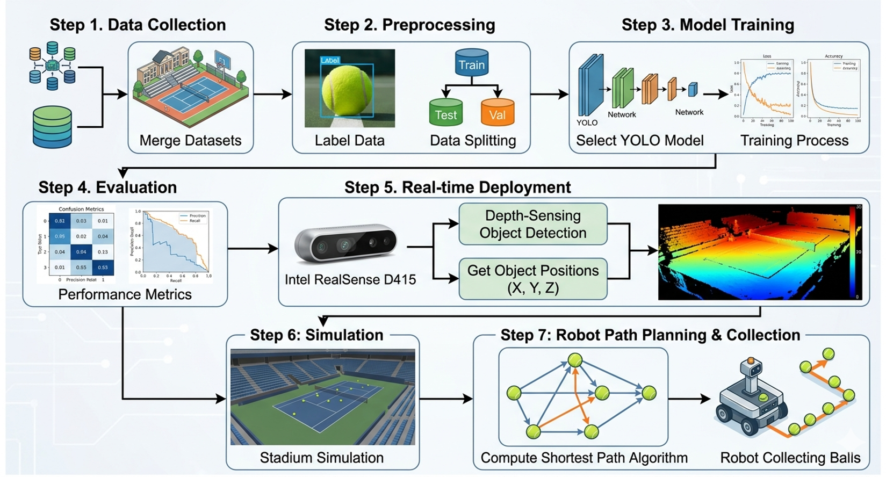
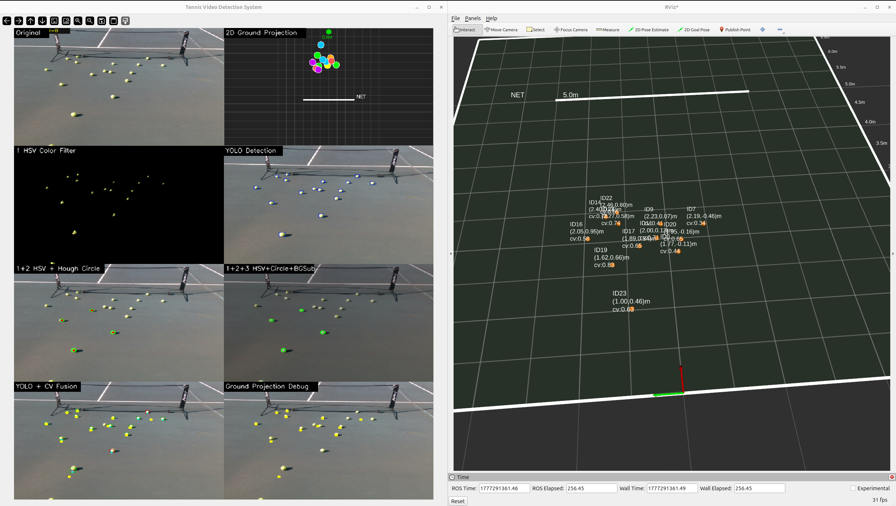
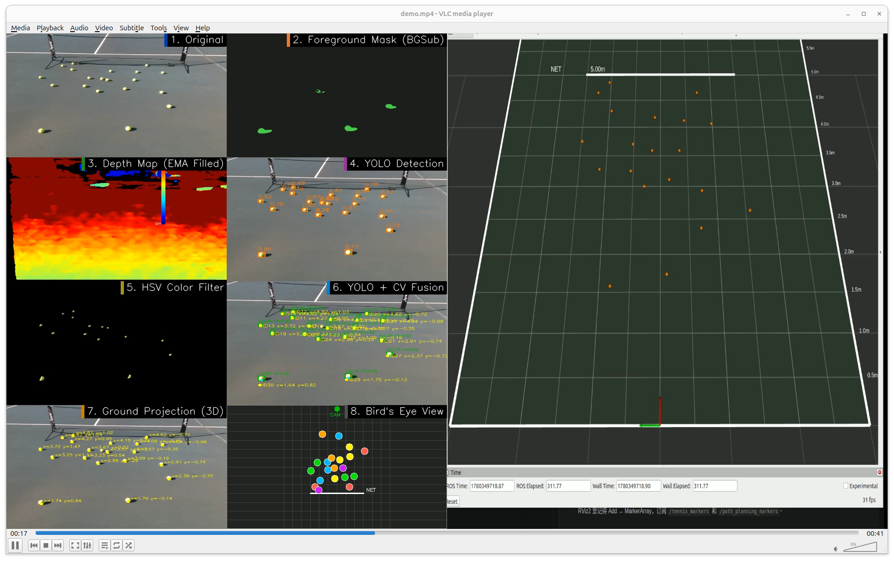
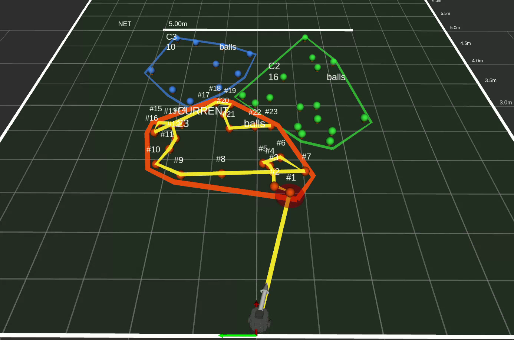

# Real-Time Tennis Ball Detection and Path Planning

This repository contains an end-to-end tennis ball detection and robotic pickup planning project using YOLOv26, Intel RealSense D415 RGB-D sensing, computer vision filtering, ROS2/RViz2 visualization, and K-means + TSP path planning.

The system detects tennis balls from RGB-D camera data or recorded RealSense `.bag` files, estimates their 3D/world positions, visualizes them in RViz2, and generates an efficient simulated robot collection route.

---

## Demo Videos
Onedrive link: https://udmercy0-my.sharepoint.com/:f:/g/personal/zhangxi24_udmercy_edu/IgCZ2shAcn4mRbNtpDvOr5nhAZmkGUGDbKtYcdDAstCpptk?e=F6iF4G

## Project Overview

During tennis training sessions, many balls are scattered across the court and must be collected manually. This project explores a perception and planning pipeline for autonomous tennis ball collection.

The complete workflow is:

```text
Dataset collection and labeling
        ↓
YOLOv26 training and cross-scene evaluation
        ↓
Real-time tennis ball detection
        ↓
HSV/CV filtering and depth-based localization
        ↓
ROS2/RViz2 visualization
        ↓
K-means clustering + TSP pickup path planning
        ↓
TurtleBot route simulation
```





---

## Demo

### Detection Demo





[Path Planning Demo Video](Demo/Media1.mp4)

### Detection Demo v2





[Path Planning Demo Video v2](Demo/Media2.mp4)


### Path Planning Demo





[Detection Demo Video](Demo/video2.mp4)


---

## Repository Structure

```text
AdvDeepLearning/
├── Data_preparation/
│   ├── realsense_bag_processing/
│   └── Yololabeler/
│
├── Tennis_dataset/
│   ├── 1_Rainbow/
│   ├── 1_Court_Tennis/
│   ├── 1_Indoor_Court/
│   ├── codes/
│   ├── experiment/
│   └── reports/
│
├── Tennis_tracking/
│   └── D415_YOLO/
│       ├── models/
│       ├── demo_benchmark/
│       ├── robot/
│       ├── launch/
│       ├── lingbot/
│       └── tools/
│
├── Tennis_Ball_Detection/
│   └── report source files and figures
│
├── Demo/
│   └── Demo and screenshots
│
├── Tennis_Ball_Detection.pdf
└── README.md
```

---

## Main Components

### 1. Data Preparation

Folder:

```text
Data_preparation/
```

This folder contains tools and intermediate data used for preparing the tennis ball datasets.

Main parts:

- `realsense_bag_processing/`: processes Intel RealSense D415 `.bag` files and extracts RGB/depth frames.
- `Yololabeler/`: custom Python click-labeling tool for manually annotating tennis balls in YOLO format.

The labeling tool allows the user to click the center of each tennis ball and automatically generate small fixed-size bounding boxes.

Example command:

```bash
python tennis_click_labeler.py --image_dir ./mylabel --output_dir ./mylabel_result
```

---

### 2. YOLOv26 Training and Evaluation

Folder:

```text
Tennis_dataset/
```

This folder contains the YOLOv26 training and cross-scene evaluation pipeline.

Datasets used:

| Dataset | Description                          |
| ------- | ------------------------------------ |
| Rainbow | Public Roboflow tennis ball datasets |
| C1      | Custom outdoor tennis court dataset  |
| C2      | Custom indoor court dataset          |

Training compositions:

| Train Set | Dataset Composition                    |
| --------- | -------------------------------------- |
| R         | Rainbow only                           |
| RC1       | Rainbow + outdoor court                |
| RC2       | Rainbow + indoor court                 |
| RC1C2     | Rainbow + outdoor court + indoor court |

The experiment evaluates:

- 3 YOLOv26 model sizes: `yolo26n`, `yolo26s`, `yolo26m`
- 4 training dataset compositions: `R`, `RC1`, `RC2`, `RC1C2`
- 6 test sets
- 72 total cross-scene evaluation runs

Main scripts:

```text
Tennis_dataset/codes/
├── step2_split_datasets.py
├── step3_build_all_combos.py
├── step4_generate_train_commands.py
└── step5_cross_eval_all.py
```

Reproduction sequence:

```bash
cd Tennis_dataset
python codes/step2_split_datasets.py
python codes/step3_build_all_combos.py
python codes/step4_generate_train_commands.py
python codes/step5_cross_eval_all.py
```

---

## Detection Results

The cross-scene evaluation shows that dataset diversity is more important than model size. The `RC1C2` training composition provides the most stable performance across indoor, outdoor, and public dataset scenes.

Top RC1C2 results:

| Model    | Train Set |  mAP50 | mAP50-95 | Precision | Recall |
| -------- | --------- | -----: | -------: | --------: | -----: |
| YOLOv26m | RC1C2     | 0.8364 |   0.5686 |    0.8125 | 0.8074 |
| YOLOv26s | RC1C2     | 0.8333 |   0.5706 |    0.8030 | 0.8116 |
| YOLOv26n | RC1C2     | 0.8255 |   0.5668 |    0.7880 | 0.8197 |

Although YOLOv26s and YOLOv26m achieve slightly higher or similar detection metrics, the differences are small. Therefore, YOLOv26n is selected as the final real-time model because it is lighter and faster while maintaining comparable detection performance.


---

## Real-Time Detection Pipeline

Folder:

```text
Tennis_tracking/D415_YOLO/
```

The real-time detection module supports both live Intel RealSense D415 input and recorded `.bag` playback.

Main scripts:

```text
detect_live.py
detect_video.py
detect_video_demo.py
rviz_live.py
rviz_video.py
rviz_video_demo.py
```

The detection pipeline includes:

1. YOLOv26n tennis ball candidate detection.
2. HSV color filtering.
3. Circularity and shape validation.
4. Background/motion cues.
5. Depth sampling from Intel RealSense D415.
6. Temporal depth smoothing.
7. Multi-frame tracking using nearest-neighbor association and EMA smoothing.
8. UDP publishing to ROS2/RViz2.

---

## RViz2 Visualization

Detected tennis balls are published as ROS2 `MarkerArray` messages and visualized in RViz2.

The visualization includes:

- Tennis ball positions
- Ball IDs
- Confidence and CV score
- Court grid
- Net position
- Camera/world coordinate frame
- Robot pickup path
- Current target marker


---

## Path Planning

The final demo uses:

```text
K-means clustering + TSP-based route planning
```

Main planner:

```text
Tennis_tracking/D415_YOLO/robot_cluster_pickup_after_demo.py
```

Launch file:

```text
Tennis_tracking/D415_YOLO/launch/robot_cluster_pickup_turtlebot.launch.py
```

Default planning configuration:

```text
cluster_method = kmeans
route_method   = tsp
```

Planning workflow:

1. Collect visible tennis ball markers from `/tennis_markers`.
2. Freeze the detected ball positions.
3. Cluster balls using K-means.
4. Solve an open TSP over cluster centroids.
5. Solve an open TSP inside each active cluster.
6. Visualize pickup order, current target, and TurtleBot route in RViz2.

For small point sets, the planner uses exact Held-Karp TSP. For larger point sets, it uses nearest-neighbor with 2-opt refinement.

Run the demo planner:

```bash
cd Tennis_tracking/D415_YOLO
ros2 launch launch/robot_cluster_pickup_turtlebot.launch.py
```

Optional parameters:

```bash
ros2 launch launch/robot_cluster_pickup_turtlebot.launch.py \
  collect_seconds:=2.0 \
  cluster_method:=kmeans \
  route_method:=tsp \
  target_clusters:=3
```

---

## Benchmark Results

Benchmark results are stored in:

```text
Tennis_tracking/D415_YOLO/demo_benchmark/
```

The benchmark compares YOLOv26n, YOLOv26s, and YOLOv26m on recorded RealSense `.bag` files.

Summary:

| Pipeline              |   FPS | Extra Cost | Sample Hole Rate | Real-Time |
| --------------------- | ----: | ---------: | ---------------: | --------- |
| YOLO + CV + raw depth | 62-85 |      ~2 ms |           38.17% | Yes       |
| YOLO + CV + Hough     | 50-68 |    ~1.5 ms |           38.17% | Yes       |
| YOLO + LingBot-depth  |   6-7 | 140-170 ms |            0.00% | No        |

LingBot-depth improves depth completeness, but the latency is too high for real-time robotic navigation. The final real-time system therefore uses raw D415 depth with temporal smoothing.


---

## Environment

### Detection Environment

Recommended for YOLO, OpenCV, RealSense, and benchmark scripts:

```bash
conda activate lingbot_test
```

Main dependencies:

```text
Python
PyTorch
Ultralytics YOLO
OpenCV
NumPy
SciPy
pyrealsense2
rosbags
scikit-learn
```

### ROS2 / RViz2 Environment

Recommended for RViz2 visualization and TurtleBot planning:

```bash
conda deactivate
source /opt/ros/jazzy/setup.bash
```

Main ROS2 dependencies:

```text
ROS2 Jazzy
rclpy
visualization_msgs
geometry_msgs
nav_msgs
sensor_msgs
tf2_ros
robot_state_publisher
turtlebot3_description
```

---

## How to Run

### 1. Run Detection on a Recorded Bag

Terminal 1:

```bash
cd Tennis_tracking/D415_YOLO
conda activate lingbot_test
python detect_video_demo.py --input Documents_2/your_file.bag --input-color swap_rb --playback-rate 0.3
```

Terminal 2:

```bash
cd Tennis_tracking/D415_YOLO
conda deactivate
source /opt/ros/jazzy/setup.bash
python3 rviz_video_demo.py
```

Terminal 3:

```bash
cd Tennis_tracking/D415_YOLO
conda deactivate
source /opt/ros/jazzy/setup.bash
ros2 launch launch/robot_cluster_pickup_turtlebot.launch.py
```

---

## Project Report

The final IEEE-style course report is included as:

```text
Tennis_Ball_Detection.pdf
```


---

## Current Limitations

- Long-range tennis ball detection is difficult with limited camera resolution and depth range.
- Intel RealSense D415 depth may contain holes or unstable values on reflective surfaces and distant objects.
- RGB-depth alignment can introduce localization error.
- Fast motion may cause tracking ID switches or unstable trajectories.
- The current robot pickup route is validated in ROS2/RViz2 simulation, not on a fully deployed physical robot.
- Obstacle-aware navigation and a real pickup mechanism are future work.

---

## Future Work

Future improvements include:

- Testing with longer-range RGB-D cameras.
- Adding multi-camera coverage.
- Improving depth completion while maintaining real-time speed.
- Deploying the system on a physical robot.
- Integrating Nav2 obstacle avoidance.
- Measuring real pickup completion rate and route efficiency.
- Improving robustness under outdoor lighting changes.

---

## Contributors

- Ahlam Al Mohammad
- Xinyang Zhang
- Vasilis Pentsos

Department of Electrical and Computer Engineering and Computer Science 
University of Detroit Mercy

---


